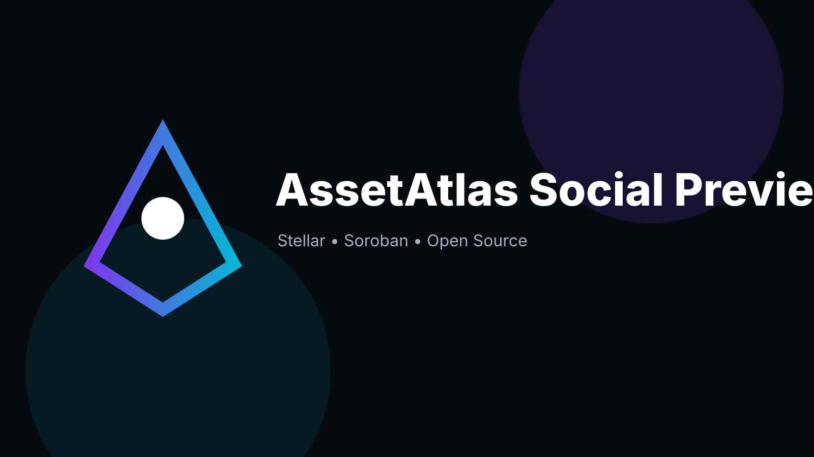
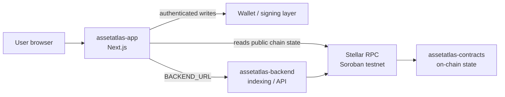

<p align="center">
  
</p>

# AssetAtlas App

> Structured Stellar asset metadata and verification — user-facing web application.


> **Status note:** v0.1.0 development baseline — **not audited and not production-ready.**

📚 **Documentation site:** [https://stellar-assetatlas.github.io/assetatlas-app/](https://stellar-assetatlas.github.io/assetatlas-app/) — user guide, backend API reference, smart contract guide, configuration and deployment docs. The source lives in [`docs/`](docs/) (MkDocs Material, built with `mkdocs build --strict` in CI).

## Why this exists

AssetAtlas provides structured, verifiable metadata for Stellar assets. On-chain state is the source of truth; off-chain services stay out of consensus-critical logic. This repository is the **user-facing web application** of the three-repo AssetAtlas system:

| Repo | Role |
| --- | --- |
| [assetatlas-contracts](https://github.com/stellar-assetatlas/assetatlas-contracts) | On-chain Soroban state and authorization |
| **assetatlas-app** (this repo) | User-facing web application |
| [assetatlas-backend](https://github.com/stellar-assetatlas/assetatlas-backend) | Off-chain indexing/API and operational services |

## Features

- Next.js (App Router) frontend with a minimal network-summary landing page.
- Stellar integration via `@stellar/stellar-sdk` (configured for **testnet**).
- TypeScript throughout, with `node --test` test runner.

## Architecture



## Tech stack

| Layer | Technology |
| --- | --- |
| Frontend | Next.js 15, React 19 |
| Language | TypeScript 5.8 |
| Blockchain | Stellar / Soroban, `@stellar/stellar-sdk` 17 |
| Testing | `node --test` |
| Linting | ESLint (`next lint`) |

## Project structure

```text
assetatlas-app/
├── app/            # Next.js App Router pages
├── lib/            # Stellar helpers
├── assets/         # Banner and logo
├── docs/           # Architecture notes
└── .github/        # CI workflow, CODEOWNERS
```

## Prerequisites

- Node.js ≥ 20
- npm

## Installation

```bash
npm install
```

## Environment variables

Copy `.env.example` to `.env.local` and fill in the values:

| Variable | Description |
| --- | --- |
| `STELLAR_NETWORK` | Target Stellar network (`testnet`). |
| `STELLAR_RPC_URL` | Soroban RPC endpoint, e.g. `https://soroban-testnet.stellar.org`. |
| `CONTRACT_ID` | Deployed AssetAtlas contract ID (leave empty until you deploy). |
| `BACKEND_URL` | URL of the assetatlas-backend service (default `http://localhost:8787`). |

## Running locally

```bash
npm run dev
```

## Testing

```bash
npm test
```

## Linting

```bash
npm run lint
```

## Building

```bash
npm run build
```

## Roadmap

Taken from the CHANGELOG and current baseline:

- [ ] Expand the landing page with real asset-metadata views backed by the contract.
- [ ] Wire the app to the deployed contract via `CONTRACT_ID`.
- [ ] Add backend-backed indexing views.
- [ ] Independent security review of the contract + app stack.

## Contributing

See [CONTRIBUTING.md](CONTRIBUTING.md). Bug reports and feature requests go through the issue tracker.

## Security

See [SECURITY.md](SECURITY.md). **This project is unaudited** — do not use in production.

## Code of Conduct

See [CODE_OF_CONDUCT.md](CODE_OF_CONDUCT.md).

## Maintainer

**Hikmaholadele** — [@Hikmaholadele](https://github.com/Hikmaholadele)

## License

[Apache-2.0](LICENSE)
